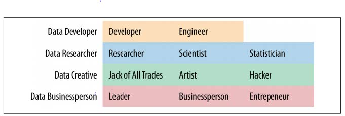
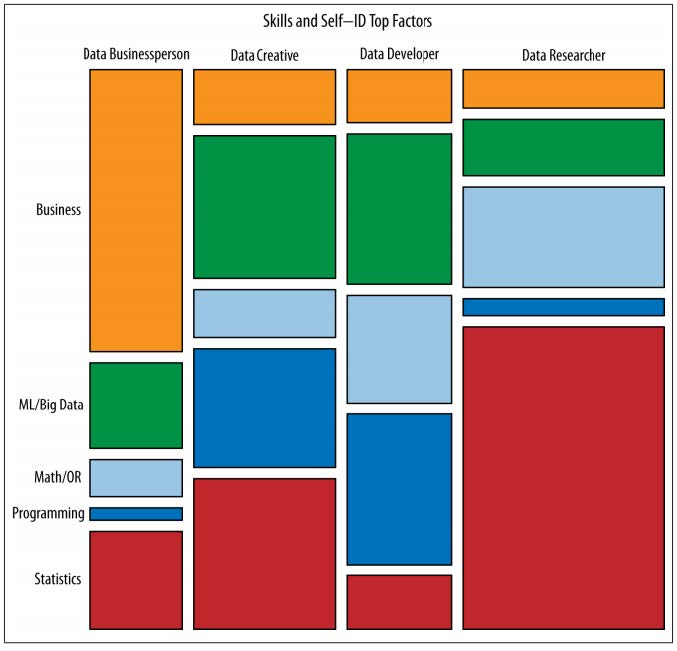
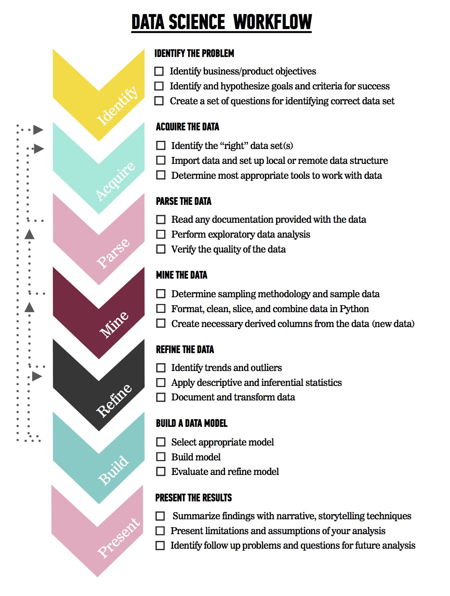

#  Welcome to Data Science
DS | Lesson 1

### LEARNING OBJECTIVES
**After this lesson, you will be able to:**

- Describe the roles and components of a successful learning environment
- Define data science and the data science workflow
- Apply the data science workflow to meet your classmates
- Setup your development environment and review python basics

### STUDENT PRE-WORK
**Before this lesson, you should already be able to:**

- Define basic data types used in object-oriented programming
- Recall the Python syntax for lists, dictionaries and functions
- Create files and navigate directories using the command line interface (for your specific environment)

### LESSON GUIDE
| TIMING | TYPE | TOPIC |
|:-:|---|---|
| 20 min | [Opening](#opening) | Welcome to GA |
| 20 min | [Introduction](#introduction1) | What is Data Science |
| 10 min | [Quiz](#quiz) | Data Science Quiz |
| 25 min | [Introduction](#introduction2) | Data Science Workflow |
| 25 min | [Guided Practice](#practice) | Workflow Application |
| 65 min | [Demonstration](#demo) | Data Science Dev Environment |
| 5 min | [Conclusion](#conclusion) | Review |

***

## Welcome to GA! (20 mins)

#### GA is a special learning environment

- Introduce the Instructor, Instructor Assistent, Producers
- GA is a global community of individuals empowered to pursue the work we love
- GA Resources: discounts, community events, hub, office hours
- GA feedback loop: exit tickets, mid-course feedback, final feedback

#### Road to Success

- Emotional cycle of change
- Student learning responsibility
- GA graduation requirements
- After GA: build network, find opportunities, community, perks
- Q \& A

***

## Introduction: What is Data Science (20 mins)

- A set of tools and techniques used to extract useful information from data
- A interdisciplinary, problem-solving oriented subject
- Application of scientific techniques to practical problems
- [Wikipedia Entry](http://en.wikipedia.org/wiki/Data_science)

#### Who uses Data Science

- Netflix - movie recommendations
- Amazon's algorithm - "you might also like x"
- Five Thirty Eight - election and sports coverage
- Draft Kings - using data science to predict daily bets
- Google - auto-translate and search results

#### Who uses Data Science in Australia

- ANZ
- Coles
- Telstra
- Crown
- SportsBet

- Do you know any other examples?

#### Just a bit more - MoneyBall

- https://en.wikipedia.org/wiki/Moneyball
- https://en.wikipedia.org/wiki/Moneyball_(film)

#### What are the roles in Data Science?

**Roles:**

- Data Developer
- Data Researcher
- Data Creative
- Data Businessperson

**Skills:**

- Business
- ML/Big Data
- Mathematics
- Programming
- Statatistics

**Break down of skills by role:**

***

## Quiz: Data Science Baseline (10 Min)

#### Quiz
1. True or False: Gender (coded: male= 0 female= 1) is a continuous variable
2. According to [this table](./assets/images/Table.png), BMI is the _____

	- Outcome
	- Predictor
	- Covariate
3. Draw a normal distribution
4. True or False: Linear regression is an unsupervised learning algorithm
5. What is a hypothesis test?

***

## Introduction: The Data Science Work Flow (25 mins)
#### Overview of Steps:
Throughout the class and for the our projects we will be following a general workflow. This workflow will help you produce **reliable** and **reproducible** results.

- **Reliable**: Accurate findings
- **Reproducible**: Others can follow your steps and get the same results

**Data Science Workflow** Steps:

1. Identify
2. Acquire
3. Parse
4. Mine
5. Refine
6. Build
7. Present

### Project 1: [Futurama Example](../../projects/unit-projects/project-01/assets/project1-example.ipynb)

##### IDENTIFY: Understand the problem:
Using Planet Express customer data from January 3001-3005, determine how likely previous customers are to request a repeat delivery using demographic information (profession, company size, location) and previous delivery data (days since last delivery, total number of deliveries)

- Identify business/product objectives:
	  - Are previous customers are to request a repeat delivery?
- Identify and hypothesise goals and criteria for success:
	  - What factors are likely to influence a customer's decision to be reuse Planet Express for Delivery?
- Create a set of questions to help you identify the correct dataset

##### ACQUIRE: Obtain the data

**Ideal data vs. data that is available**
Often times we start by identifying the **ideal data** we would want for a project.

During the data acquisition phase, we'll learn about the limitations on the types of data that are available. We have to decide if these limitations will inhibit our ability to answer our question of interest or if we can work with what we have to find a reasonable and reliable answer.

Data for this example:
- demographic information (profession, company size, location)
- previous delivery data (days since last delivery, total number of deliveries)

Questions we may ask include:

- Identifying the "right" dataset(s)
- Is there enough data?
- Does it appropriately align with the question/problem statement?
- Can the dataset be trusted? How was it collected?
- Is this dataset aggregated? Can we use the aggregation or do we need to get it pre-aggregation?
- Assess resources, requirements, assumptions and constraints
- Import data from the web (Google Analytics, HTML, XML)
- Import data from a file (CSV, XML, TXT, JSON)
- Import data from a preexisting database (SQL)
- Set up local or remote data structure
- Determine most appropriate tools to work with data
- Tool follows the format, size of the dataset

##### PARSE: Understand the data
Many times we are given **secondary data**, or data that was collected previously. In these cases, we have to learn as much as possible about our data using tools like data dictionaries and source documentation to determine how the data was gathered.

Example data dictionary:

Variable | Description | Type of Variable
---| ---| ---
Profession | Title of the account owner | Categorical
Company Size | small=1, medium=2, large=3 | Categorical
Location | Planet of the company | Categorical
Days since last delivery | Integer | Numerical, Discrete
Number of deliveries | Integer | Numerical, Discrete

**Common questions include:**

- Read any documentation provided with the data (e.g. data dictionary above)
- Perform exploratory surface analysis via filtering, sorting and simple visualisations
- Describe data structure and the information being collected
- Explore variables, data types via select
- Assess preliminary outliers, trends
- Verify the quality of the data (feedback loop -> 1)

##### MINE: Prepare, structure and clean the data
Often times, our data will need to be cleaned prior performing an analysis.

Common steps include:

- Sample the data, determine sampling methodology
- Iterate and explore outliers, null values via select
- Introducing qualitative vs quantitative data
- Format and clean data in Python (dates, number signs, formatting)
- Define how to appropriately address missing values (cleaning)
- Categorisation, manipulation, slicing, format, integrate data
- Format and combining different data points, separate columns, etc
- Determine most appropriate aggregations, cleaning, etc. methods
- Create necessary derived columns from the data (new data)

##### REFINE: Exploratory data analysis
As an example of basic statistics, you might check the Mean (STD) or specific frequency counts.

Variable | Mean (STD) or Frequency (%)
---| ---
Number of Deliveries | 50.0 (10)
Earth | 50 (10%)
Amphibios 9 | 100 (20%)
Bogad | 100 (20%)
Colgate 8 | 100 (20%)
Other| 150 (30%)

These descriptive stats allow us to:

- Identify trends and outliers
- Decide how to deal with outliers - excluding, filtering and communication
- Apply descriptive and inferential statistics
- Determine initial visualisation techniques
- Document and capture knowledge
- Choose visualisation techniques for different data types
- Transform data

##### BUILD: Create a data model
We select a model based on the outcome we are interested in or the assumptions of the model we are using. An example of a model statement might look like this:

- We completed a logistic regression using Statsmodels v. XX. We calculated the probability of a customer placing another order with Planet Express

Here, we are using a logistic model because we are determine the probability that a customer may place a return order, which at its heart is a **classification problem**.

The steps for model building are:

- Select appropriate model
- Build model
- Evaluate and refine model
- Predict outcomes, action items

##### PRESENT: Communicate the results of your analysis
Presentations are a critical part of your analysis. It doesn't matter how brilliant your model is or how illuminating your findings are, if you are not able to effectively communicate your results then they will not be used.

The most basic form of a data science presentation should include a simple sentence that describes your results:

- "Customers from large companies had twice (CI 1.9, 2.1) the odds of of placing another order with Planet Express compared to customers from small companies."

Data science presentations can also be far more complex and exciting, like some of the [research presented by Nate Silver's 538 blog](http://fivethirtyeight.com/burrito/#brackets-view).

When creating a presentation, always consider your audience and make sure to practice your presentation beforehand. Consider the types of questions people might have or - better yet - test your presentation on a few people and pay attention to their response. Clarify and refine your presentation accordingly.

Make sure to consider your needs and goals as well as those of your audience. A presentation created for your fellow data scientists will be vastly different than a presentation intended for some executives who are trying to make a business decision.

Key factors of a good presentation include:

- Summarise findings with narrative and storytelling techniques
- Refine your visualisations for broader comprehension
- Present both limitations and assumptions
- Determine the integrity of your analysis
- Consider the degree of disclosure for various stakeholders
- Test and evaluate the effectiveness of your presentation beforehand

##### Examples

- [Sydney vs Melbourne - Which Is The Best City To Drive In?](Sydney vs Melbourne - Which Is The Best City To Drive In?)
- [Ready for a career change? You're not alone](visual.ly/ready-career-change-youre-not-alone)
- [Australian Tourism Infographic](Australian Tourism Infographic)

##### A Note About Iteration
Iteration is an important part of **every step** in the Data Science Workflow. At any given point in the process, you may find yourself repeating or going back and re-doing elements in order to better understand your data, clarify your model and refine your presentation.

For example, after presenting your findings, you may want to:

- Identify follow-up problems and questions for future analysis
- Create a visually effective summary or report
- Consider the needs of different stakeholders and how your report might be changed for them
- Identify the limitations of your analysis
- Identify relationships between visualisations

***

## Practice: Data Science Work Flow (25 mins)
Use three of the steps from the Data Science Workflow (identify, acquire, present) to get to know your classmates!

#### IDENTIFY: Understand the problem
Have each group develop 1 research question that they would like to know about the class and make a hypothesis.

Examples:

- What is your current favorite tool for working with data?
- What are you most excited about learning?
- What can you help your classmates with when it comes to data analysis?

#### ACQUIRE: Obtain the data
Rotate through the groups to "collect the data" and record the raw data on white boards.

#### PRESENT: Communicate the results of your analysis

- Summarise findings in a narrative
- Provide a basic visualisation for broader comprehension on white board
- Have one student present for the group

***

## Demonstration: Dev Environment Setup (65 min)

- Brief introduct to the tools we will use as data scientists
- Workshop to help with environment set up
- Jupyter Notebook to test dataset and complete Python Review

***

## Conclusion (5 mins)
By now, you should be able to answer the following questions with ease:

- What is data science?
- What is the data science workflow?
- How can you have a successful learning experience at GA?

***

### BEFORE NEXT CLASS

**Homework:**

- Resolve any installation issues before next class
- Make sure you have a Github profile

**Optional:**

- Read [Analyzing the Analyzers](http://cdn.oreillystatic.com/oreilly/radarreport/0636920029014/Analyzing_the_Analyzers.pdf) for a useful look at the different types of data scientists.
- Review the class
- Read about some [Markdown Techniques](http://daringfireball.net/projects/markdown/syntax)

|   |   |
|---|---|
| **UPCOMING PROJECTS** | [Unit Project 1 Instructions](../../projects/unit-projects/project-01/README.md) |

### ADDITIONAL RESOURCES
- Simon Lehna Singh, MBE is a British popular science author whose works largely contain a strong mathematical element. His written works include Fermat's Last Theorem, The Code Book, Big Bang, Trick or Treatment and The Simpsons and Their Mathematical Secrets?
    - [Simon Singh on Wikipedia](https://en.wikipedia.org/wiki/Simon_Singh)
    - [Simon Singh personal site](http://simonsingh.net)
- Videos about numbers - it's that simple, by Brady Haran
    - [Numberphile](https://www.youtube.com/user/numberphile)
- Watson is a technology that understands all forms of data
and reasons and learns at scale
    - [IBM Watson on Wikipedia](https://en.wikipedia.org/wiki/Watson_(computer))
    - [Web site](http://www.ibm.com/watson/)
    - If curious, check the [youTube](https://www.youtube.com/results?search_query=ibm+watson+jeopardy+development)
- This course gives you easy access to the invaluable learning techniques used by experts in art, music, literature, math, science, sports, and many other disciplines
    - [Learning How to Learn](https://www.coursera.org/learn/learning-how-to-learn)