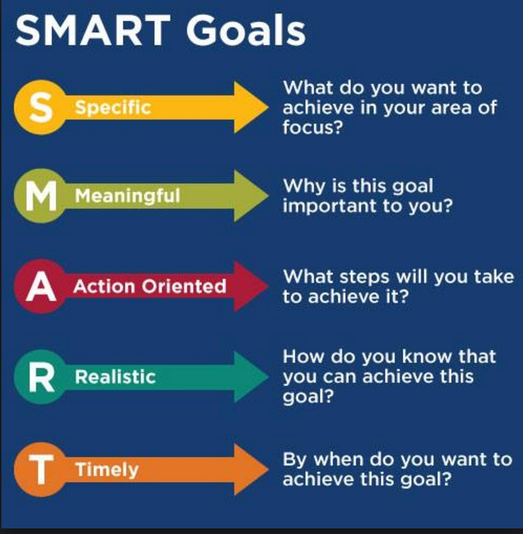

#  Experimental Design and Pandas
DS | Lesson 2

### LEARNING OBJECTIVES
**After this lesson, you will be able to:**

- Define a problem and types of data
- Identify dataset types
- Define the Data Science Workflow
- Apply the Data Science Workflow in the context of pandas
- Write an Jupyter Notebook to import, format and clean data using the Pandas Library

### STUDENT PRE-WORK
**Before this lesson, you should already be able to:**

- Create, open and create a Jupyter notebook
- Have completed python pre-work

### LESSON GUIDE
| TIMING | TYPE | TOPIC |
|:-:|---|---|
| 5 min | [Opening](#opening) | Lesson Objectives |
| 10 min | [Introduction](#introduction1) | The why's and how's of a good question |
| 10 min | [Demonstration](#demo1) | Diagraming a high quality aim |
| 10 min | [Lecture](#lecture1) | Types of datasets |
| 10 min | [Guided Practice](#guidedpractice) | Write a research question with raw data |
| 5 min | [Knowledge Check](#review1) | Section 1 Review |
| 5 min | [Introduction](#introduction2) | Datascience workflow steps 2. Acquire and 3. Parse |
| 10 min | [Demonstration](#demo2) | Walkthrough Acquire and Parse with Pandas |
| 30 min | [Codealong](#codealong) | Pandas Introduction |
| 5 min | [Introduction](#introduction3) | Lab Walkthrough |
| 20 min | [Independent Practice](#lab) | Lesson 2 lab |
| 10 min | [Conclusion](#conclusion) | Review lab and lesson objectives |
| 15 min | [Wrap-up](#wrapup) | Unit 1, project, where we're headed |

---

## Opening (5 min)

- Review Current Lesson Objectives
    - Review Data Science workflow
    1. Identify
    2. Acquire
    3. Parse
    4. Mine
    5. Refine
    6. Build
    7. Present

Today we will focus on steps 1-2. We will dive into steps 3-5 over the next few classes.

## Introduction: Asking a good question (10 mins)

#### Why we need a good question/aim
"A problem well stated is half solved."

By having a high quality question/aim you set yourself up for success as you being your analysis. You also establish the basis for making your analysis reproducible. A clearly articulated research question not only helps other data scientists learn from and reproduce your work, but also helps them expand on your work in the future.

#### What is a good question?
The goals of a high quality, reproducible question are similar to the SMART Goals Framework.

- S: specific
- M: measurable
- A: attainable
- R: relevant
- T: time-bound

Let's break this down further:

1. Specific: The dataset and key variables are clearly defined.
2. Measurable: The the type of analysis and major assumptions are articulated.
3. Attainable: The question you are asking is feasible for your dataset and is not likely to be biased.
4. Reproducible: Another person (or you in 6 months!) can read your state and understand exactly how your analysis is performed
5. Time-bound: You clearly state the time period and population for which this analysis will pertain

## Demonstration: Diagraming an aim (5 mins)

Example aim:
Determine the association of foods in the home with child dietary intake. Using one 24-hour recall from the cross-sectional NHANES 2007-2010, we will determine the factors associated with food available in the homes of American children and adolescents. We will test if reported availability of fruits, dark green vegetables, low fat milk or sugar-sweetened beverages available in the home increases the likelihood that children and adolescents will meet their USDA recommended dietary intake for that food.

Hypothesis: Children will be more likely to meet their recommended intake level when a food is always available in their home compared to rarely of never.

Source: From Dr. Amy Roberts' Dissertation

1. Specific: Using **one 24-hour recall** from the cross-sectional National Health and Nutrition Examination Survey (NHANES) 2007-2010, we will determine the factors associated with food available in the homes of **American children and adolescents**. We will test if **self-reported availability of fruits, dark green vegetables, low fat milk or sugar-sweetened beverages available in the home increases** the likelihood that children and adolescents will meet their **USDA recommended dietary intake** for that food. Our hypothesis is that children will be **more likely to meet their recommended intake level when a food is** _**always**_ **available in their home** (compared to rarely or never).
    - How data was collected is indicated:
        - 24-hour recall, self-reported
    - What data was collected is stated:
        - Fruits, dark green vegetables, low fat milk or sugar-sweetened beverages; always vs rarely available
    - How data will be analyzed is defined:
        - Using USDA recommendations as a gold-standard to measure the association
    - The specific hypothesis and direction of the expected associations are described:
        - Children will be more likely to meet their recommended intake level

2. Measurable: Determine the association of foods in the home with child dietary intake. We will test if the reported availability of fruits, dark green vegetables, low fat milk or sugar-sweetened beverages available in the home increases the likelihood that children and adolescents will meet their USDA recommended dietary intake for that food.

3. Attainable: Cross-sectional data has specific limitations- one of the most common is that **causal inference is typically not possible**. Note that we are determining the association between two items (food available in the home and children meeting their dietary recommendations). Because we are using cross-sectional data, we cannot say that having fruits and vegetables in the home actually **causes** children to meet their dietary requirements.

4. Reproducible: By having all the specifics we indicated previously, it should be straight forward for others to Google NHANES, pull the right datasets and reproduce this work.

5. Time Bound: Using one 24-hour recall from **NHANES 2007-2010**, we will determine the factors associated with food available in the homes of **American children and adolescents**.

**Point**: Trends often change over time and vary by the population or source of your data. It is important to clearly define who/what you included in your analysis as well as the time period for the analysis.

#### Context
Depending on your setting, the types of questions you will answer may vary. The previous example is from a research setting. In a business setting, you will need to clearly articulate the business objectives. You should also ID and hypothesize the goals and criteria for success.

For example, "success" for the Netflix recommendation engine might be stated as: 70% of customers over the age of 18 select a movie from the recommended queue during Q3 of 2015. Regardless of setting, stating your question using the SMART framework will help you achieve your objectives.

#### Knowledge Check
Which of the following questions uses the SMART framework? Why? What is missing?

1. I am looking to see if there is an association with number of passengers with carry on luggage and delayed take-off time
2. Determine if the number of passengers on JetBlue, Delta and United domestic flights with carry-on luggage is associated with delayed take-off time using data from flightstats.com from January 2015- December 2015

#### Why data types matter

As we saw in the attainable section above, different types of data have different limitations and strengths. Therefore, certain types of analysis will not be possible with certain datasets. Here is a brief overview of some of the different types of datasets:

1. **Cross-Sectional Data:** All information is determined at the same time; all the data comes from the same time period

    - **Issues**: TEMPORALITY
        - There is no distinction between **exposure** and **outcome**. This is why in the example above, we can't say that the availability of fruit in the home actually **causes** children to meet their recommendations. It is just as likely that the opposite may be true.
    - **Strengths**
        - Often population-based
        - Generalizability
        - Reduced cost compared to other types of data collection methods
    - **Weaknesses**
        - Separation of cause and effect may be difficult or impossible
        - Variables/Cases with long duration are over-represented

2. **Time-Series/Longitudinal Data:** The information (data) is collected over a period of time

    - **Strengths**
        - Unambiguous temporal sequence – exposure precedes outcome
        - Multiple outcomes can be measured

    - **Limitations**
        - Expense
        - Takes a long time
        - Vulnerable to missing data

**Check:**

- What type of data is the "flightstats" data?
- Determine if the number of passengers on JetBlue, Delta and United domestic flights with carry-on luggage is associated with delayed take-off time using data from flightstats.com from January 2015- December 2015
- Can you create a cross-sectional analysis from a longitudinal data collection? How?

## Guided Practice: Write a research question with raw data (10 mins)
Looking at the data from Kaggle's Titanic competition, let's write a high quality research question.

- Resource: [Data dictionary](https://www.kaggle.com/c/titanic/data)
- Format: Think, Pair, Share

**Check:**

1. Q: What type of data is this cross-sectional or longitudinal?
    - A: cross-sectional

2. Q: What will we be measuring (hint: look back at the previous example)
    - A: The association between being a woman or a child and survival on the Titanic.

3. Q: Write out a SMART aim for this data:
    - A: Using data from April 15, 1912, taken from the Titanic disaster, we will determine the association of gender, age (in years) and survival.

## SMART Review
The S.M.A.R.T. process covers the "Identify" step of the data science workflow. We also explored the strengths and weaknesses of two types of data.

1. SMART analysis aims
2. Types of a datasets: Cross-Sectional vs Longitudinal/Time Series

Questions?

## Data science workflow: Acquire and Parse (5 mins)

During this section we are going to walk through key features of steps 2 and 3 of the data science workflow. We will be working with an Jupyter Notebook. I'll demonstrate the steps first, then we will try them together. During the last part of class, you will try your hand at the steps individually.

## Demonstration: Walkthrough Acquire and Parse with Pandas (30 mins)

#### Acquire
You'll remember from the previous class that the "Acquire" step is where we determine if the dataset we have is the "right" dataset for our question.

One factor is what type of data is it: Cross-sectional? Longitudinal/Time Series? The next question is how well was the data collected? Does it have a ton of missing data? Was the instrument used to collect the data validated and reliable? Is this dataset aggregated? Can we use the aggregation or do we need to get it pre-aggregation?

#### Logistics of acquiring your data
You can access data through a variety of different methods, including:
1. Web (Google Analytics, HTML, XML)
2. File (CSV, XML, TXT, JSON)
3. Databases (SQL, no-sql, etc)

Today will be using a CSV (comma separated value) file in our lab.

#### Parse, Understanding your data
Before and after you acquire your data, you also want to make sure you understand what data you've collected. This ensures that you've collected the **right** data and helps you figure out how it can be used. To better understand your data, there are a number of steps you might follow:

- Create or review the data dictionary
- Perform exploratory surface analysis via filtering, sorting and simple visualizations
- Describe data structure and the information being collected
- Explore variables and data types via select

#### Introduction to data dictionaries and documentation
Data dictionaries are often our primary source to help judge the quality of our data and also to understand how it is coded. If our gender variables are coded 0 and 1, how do we know which is male and which is female? Your data dictionary! Is your currency variable coded in dollars or euros? Data dictionary!

##### Data Dictionary / Code Book Examples

Data dictionaries are also where you'll identify any requirements, assumptions and constraints of your data. Note that you should never assume that a pre-existing data dictionary is complete. It is often going to be up to you to test your assumptions and add to your dictionary.

1. The [U.S. National Epidemiological Survey on Alcohol and Related Conditions (NESARC)](https://d396qusza40orc.cloudfront.net/phoenixassets/data-management-visualization/NESARC%20Wave%201%20Code%20Book%20w%20toc.pdf) is a survey designed to determine the magnitude of alcohol use and psychiatric disorders in the U.S. population. It is a representative sample of the non-institutionalized population 18 years and older.
    - [NESARC codebook (.pdf)](https://d396qusza40orc.cloudfront.net/phoenixassets/data-management-visualization/NESARC%20Wave%201%20Code%20Book%20w%20toc.pdf)
2. The [Mars Craters](https://d396qusza40orc.cloudfront.net/phoenixassets/data-management-visualization/Mars%20Crater%20Codebook.pdf) **Study**, presents a global database that includes over 300,000 Mars craters 1 km or larger that were created between 4.2 and 3.8 billion years ago during a period of heavy bombardment (i.e. impacts of asteroids, proto-planets, and comets).
    - [Mars Crater codebook (.pdf)](https://d396qusza40orc.cloudfront.net/phoenixassets/data-management-visualization/Mars%20Crater%20Codebook.pdf)

**Check:** What is a 'data dictionary' and what is it used for? Why?

## Code Along - Numpy and Pandas introduction (30 minutes)

What is Numpy and Pandas?
Pandas is built on Python. In Numpy, we use arrays. With arrays you can do:

1. basic math.
2. splicing, indexing, etc.

Pandas uses data structures that will look more familiar to folks who have used excel or other spreadsheet based tools. These are called **Dataframes**. A Dataframe contains rows and columns.

Similarly, you can select pieces of data, do basic operations and calculate summary statistics. Let's see some examples:

Additionally, we often have to merge data together, correct missing data and plot our findings. Let's see some examples of each of these:

**Check:** What is a 'dataframe' and when would you use one?

## Lab Walkthrough (5 min)

This lab is based on a quiz given in Roger Peng's "Computing for Data Analysis" class on Coursera. During the lab you will read in and merge two datasets "ozone" and "data". By the end of the lab, you will:

1. Merge datasets
2. Check basic features, such as column names, number of observations
3. Find and drop missing values
4. Find basic stats like mean and max (more on these next time!)

The purpose of this lab is to get some practice working with Pandas. We will dive into stats more next week.

## Lesson 2 Lab (20 min)

[Lesson 2 Lab](./code/starter/starter-2.ipynb)

## Conclusion (10 mins)

- Review solutions and questions from lab
- Review objectives from class

## Unit 1, project, where we're headed (15 mins)

- Review Unit 1 objectives
- Introduce the first project
- Exit tickets

***

### EXIT TICKET

[Exit Ticket Link](https://goo.gl/forms/c29A8Od4JQ0gZncI2)

#### What's the lesson number?
- 02

#### What was the topic of the lesson?
- Experimental Design and Pandas

***

### BEFORE NEXT CLASS
| | |
|---|---|
| **UPCOMING PROJECTS** | [Unit Project 1](../../projects/unit-projects/project-1/README.md) |

### ADDITIONAL RESOURCES
- Movie: The Imitation Game
    - [Trailer on youTube](https://www.youtube.com/watch?v=S5CjKEFb-sM)