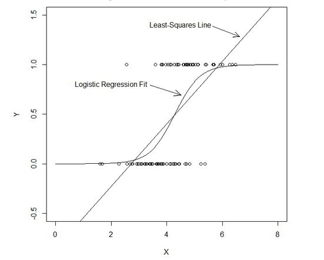
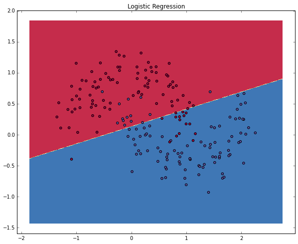

#  Introduction to Logistic Regression
DS | Lesson 9

### LEARNING OBJECTIVES
**After this lesson, you will be able to:**
- Build a Logistic regression classification model using the statsmodels library
- Describe the sigmoid function, odds and odds ratios as well as how they relate to logistic regression
- Evaluate a model using metrics, such as: classification accuracy/error, confusion matrix, ROC / AOC curves and loss functions

### STUDENT PRE-WORK
**Before this lesson, you should already be able to:**
- Implement a linear model (LinearRegression) with sklearn or statsmodels
- Define the concept of coefficients
- Recall metrics for accuracy and misclassification
- Recall the differences between L1 and L2 regularization

### LESSON GUIDE
| TIMING | TYPE | TOPIC |
|:-:|---|---|
| 5 min | [Opening](#opening) | Discuss lesson objectives, Reviewing Probability |
| 20-25 mins | [Introduction](#intro-logit) | Introduction to Logistic Regression |
| 10-15 mins | [Demonstration](#demo-logit) | Demonstration of the Sigmoid Function |
| 10-15 mins | [Guided Practice](#guided-practice-logit) | Calculating Probabilities given Odds using Sigmoid |
| 15-20 mins | [Independent Practice](#ind-practice-logit) | Implementing and Practicing Logistic Regression in Sklearn |
| 20-25 mins | [Introduction](#intro-eval) | Introduction to additional classification metrics and the confusion matrix |
| 10-15 mins | [Guided Practice](#guided-practice-eval) | Determining proper metrics given classification problems |
| 30-35 mins | [Independent Practice](#ind-practice-eval) | Optimizing a logistic regression using new metrics |
| 5-10 mins | [Conclusion](#conclusion) | Review |

<a name="opening"></a>
## Opening (5 minutes)

Read through the following questions and brainstorm answers for each:

1. In class, we have covered two different types of algorithms so far: the **linear model** (ordinary least squares, OLS) and **k-nearest neighbors** (KNN). What are the main differences between these two? What is different about how they approach solving the problem?
    - For example, what is **interpretable** about OLS compared to what is **interpretable** in KNN?

    > A: OLS is used to solve a continuous regression problem, while KNN is used to solve a categorical problem.

2. What would be the advantage of using a linear model like OLS to solve a classification problem, compared to KNN?
    - What are some challenges for using OLS to solve a classification problem (say, if the values were either 1 or 0)?

<a name="intro-logit"></a>
## Introduction to Logistic Regression

Logistic Regression is a **linear** approach to solving a classification problem. That is, we can use a linear model, similar to Linear Regression, in order so solve if an item **belongs or does not belong** to a class label.

### Challenge! Linear Regression Results for Classification

Regression results, as defined, can have a value ranging from negative infinity to infinity. However, not all regression problems will use that entire range. For example, imagine predicting a football player's salary: it would not be negative and while it would be high, there is an eventual cap.

Classification is used when the predicted values (class labels) are not necessarily greater or less than each other. Logically this makes sense, but since most classification problems are binary (0 or 1) and 1 is technically greater than 0... would not it make sense to apply the concept of a regression to solve classification? How could we contain those bounds?

Below, we will review some approaches to regression that will show us how to apply it to classification problems.

### Fix 1: Probability

One approach is to predict the probability that an observation belongs to a certain class. We could assume that the **prior** probability (or the **bias**) of a class is the class distribution.

For example, if we know that roughly 700 people from the Titanic survived out of 2200 total, then without knowing anything about the passengers and crew, the probability of survival would be ~0.32 (32%). However, we still need a way to use a linear function to either increase or decrease the probability of an individual, given any additional data we know about them.

**Check**: This prior probability is most similar to which value in the ordinary least squares formula?

### Fix 2: Link Functions and the Sigmoid Function



Another advantage to Ordinary Least Squares is that it allows for **generalized** models using a **link** function. Link functions allow us to build a relationship between a linear function and the mean of a distribution.

**Check**: What was the distribution most aligned with OLS/Linear Regression?

For classification, we need a distribution associated for categories: the probability of a given event, given all events. The link function that best allows for this is the **logit** function, which is the inverse of the **sigmoid** function.

We will start with sigmoid function. A **sigmoid function**, quite simply, is a function that visually looks like an s. While it serves many purposes, a sigmoid function is useful in logistic regression.

Our sigmoid function is defined mathematically as:

`1 / 1 + e^-t`

Recall that `e` is the inverse of the natural log. As t increases/decreases, the result is closer to 1 or 0. When t = 0, the result would be 0.5.

Since `t` decides how much to increase or decrease the value away from 0.5, `t` can help with interpretation when solving for something like a coefficient. But in its current form, it is not as useful.

<a name="demo-logit"></a>
### Demonstration: What does the Sigmoid Function look like on a chart?

Use the sigmoid function above (`1 / 1 + e^-t`) with values of `t` between -6 and 6 and chart in on a graph. Do this by hand or write some python code to evaluate it (`e = 2.71`). Do we get the s shape we expect?

### Fix 3: Odds and Log-Odds

As mentioned above, the **logit** function is the inverse of the **sigmoid** function and acts as our **link** function. Mathematically it is represented as:

`ln(p / (1 - p))`

Here, the value within the natural log (`p / (1 - p)`) represents **odds**. Taking the natural log of odds generates **log odds** (hence, logit).

The beauty of the logit function is that it allows for values between negative infinity and infinity, but provides us probabilities between 0 and 1.

**Check:** Why is this important? What does this remind us of?

For example, a logit value (log odds) of 0.2 (or odds of ~1.2/1):

`0.2 = ln(p / (1 - p))` ()

with a mean probability of 0.5, means the adjusted probability would be **about** 0.55:

`1 / (1 + e^-0.2)` (python: `1 / (1 + numpy.exp(-0.2)`)

While the logit value (log odds) represents the **coefficients** in the logistic function, we can convert them into odds ratios that would be more easily interpretable.

It is through these coefficients that we gain our overall probability: the logistic regression draws a linear decision line which solves if an observation belongs in one class or another:



<a name="guided-practice-logit"></a>
## Guided Practice: Wager these odds!

Given the odds below for some football games, use the **logit** function and the **sigmoid** function to solve for the **probability** that the "better" team would win.

You will first want to write two python functions:

```python
def logit_func(odds):
    # uses a float (odds) and returns back the log odds (logit)
    return None

def sigmoid_func(logit):
    # uses a float (logit) and returns back the probability
    return None
```

```
1. Collingwood   : Carlton     5.0 : 1
2. Essendon      : West Coast 20.0 : 1
3. Geelong       : Adelaide    1.1 : 1
4. Port Adelaide : Richmond    1.8 : 1
5. Hawthorn      : Sydney      1.6 : 1
```

<a name="ind--practice-logit"></a>
## Independent Practice: Logistic Regression Implementation

Use the data `collegeadmissions.csv` and the [Logistic Regression](http://scikit-learn.org/stable/modules/generated/sklearn.linear_model.LogisticRegression.html) estimator in sklearn in order to predict the target variable `admit`. Your objectives are:

1. What is the bias, or prior probability, of the dataset?
2. Build a simple model with one feature and explore the `coef_` value: does this represent the odds or logit (log odds)?
3. Build a more complicated model using multiple features. Interpreting the odds, which features have the most impact on admission rate? Which features have the least?
4. Report back on the accuracy of your model.

<a name="intro-eval"></a>
## Introduction: Advanced Classification Metrics: Precision, Recall, AUC.

Accuracy is only one of several metrics used when solving for a classification problem. It is best defined as `total predicted correct / total data set`. But accuracy alone is not always usable.

For example, if we know a prediction is 75% accurate, accuracy does not provide any insight into why the 25% was wrong. Was it wrong **equally** across all class labels? Did it just guess one class label for all predictions and 25% of the data was just the other label?

It is important to look at other metrics to fully understand the problem.


We can split up the accuracy of each label by using **True Positive Rate** and **False Positive Rate**.

- **True Positive Rate (TPR)**: Out of all of the target class labels, how many were accurately predicted to belong to that class?
    - Real world example: Given a medical exam that tests for cancer, how often does it correctly identify patients with cancer?

- **False Positive Rate (FPR)**: The inverse of TPR. Out of all items not belonging to a class label, how many were predicted as belonging to the target class label?
    - Real world example: Given a medical exam that tests for cancer, how often does it trigger a "false alarm" by saying a patient has cancer when they actually do not?

Likewise, this can be inverted: how often does a test **correctly** identify patients without cancer and how often does a test **incorrectly** identify patients as being cancer-free when they might actually have cancer! By building on true positive and false positive rates, you can get a much clearer picture of where predictions begin to fall apart.

A good classifier would have a true positive rate approaching 1 and a false positive rate approaching 0. In a binary problem (say, predicting if someone smokes or not), it would accurately predict **all** of the smokers as smokers and not accidentally predict any of the nonsmokers as smokers.

Logically, we like single numbers for optimizing, so we can use a metric called Area Under the Curve (AUC), which summarizes the impact of TPR and FPR in one single value. This is also called the Receiver Operating Characteristic (ROC). ROC/AUC is a measure of area under a curve that is described by the TPR and FPR.


Using the logic of TPR and FPR above:

1. If we have a TPR of 1 (all positives are marked positive) and an FPR of 0 (all negatives are not marked positive), we would have an AUC of 1. This means everything was accurately predicted.
2. If we have a TPR of 0 (all positives are not marked positive) and an FPR of 0 (all negatives are marked positive), we would have an AUC of 0. This means nothing was predicted accurately.
3. An AUC of 0.5 would suggest randomness (somewhat) and is an excellent benchmark to use for prediction (is my AUC above 0.5?)

Keep in mind that sklearn has all of these metrics on [one handy page](http://scikit-learn.org/stable/modules/classes.html#sklearn-metrics-metrics).

<a name="guided-practice-eval"></a>
## Guided Practice: How to decide which metric to use?

While AUC seems like a nice "golden standard" for evaluating binary classification, it could be _further_ improved, depending on your classification problem. There will be instances where error in positives vs negative matches will be very important.

For each of the following examples:

1. Write a confusion matrix: true positive, false positive, true negative, false negative. Then decide what each square represents for that specific example.
2. Define the **benefit** of a true positive and true negative.
3. Define the **cost** of a false positive and false negative.
4. Determine at what point does the cost of a failure outweigh the benefit of a success? This would help you decide how to optimize TPR, FPR and AUC.

**Examples**

1. A test is developed for determining if a patient has cancer or not
2. A newspaper company is targeting a marketing campaign for "at risk" users that may stop paying for the product soon.
3. You build a spam classifier for your email system.

<a name="ind-practice-eval"></a>
## Independent Practice: Evaluating Logistic Regression with Alternative Metrics

[Kaggle's common online exercise](https://www.kaggle.com/c/titanic) is exploring survival data from the Titanic.

**Learning Goals**:

1. Spend a few minutes determining which data would be most important to use in the prediction problem. You may need to create new features based on the data available. Consider using a feature selection aide in sklearn. For a worst case scenario, identify one or two strong features that would be useful to include in this model.

2. Spend 1-2 minutes considering which **metric** makes the most sense to optimize. Accuracy? FPR or TPR? AUC? Given the business problem of understanding survival rate aboard the Titanic, why should you use this metric?

3. Build a tuned Logistic model. Be prepared to explain your design (including regularization), metric and feature set in predicting survival using any tools necessary (such as a fit chart). Use the [starter code](./code/starter-code/starter-code-9.ipynb) to get you going.

<a name="conclusion"></a>
### Review

1. What is the link function used in logistic regression?
2. What kind of machine learning problems does logistic regression address?
3. What do the **coefficients** in a logistic regression represent? How does the interpretation differ from ordinary least squares? How is it similar?
4. How does True Positive Rate and False Positive Rate help explain accuracy?
5. What would an AUC of 0.5 represent for a model? What about an AUC of 0.9?
6. Why might one classification metric be more important to tune than another? Give an example of a business problem or project where this would be the case.

***

### BEFORE NEXT CLASS
|   |   |
|---|---|
| **DUE TODAY** | [Project 3](../../projects/unit-projects/project-03/README.md) |
