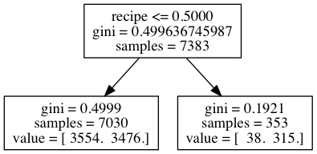
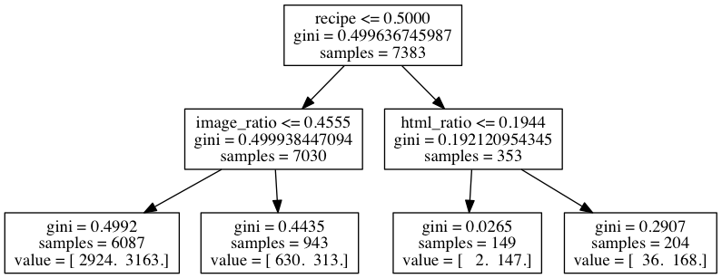

#  Decision Trees and Random Forests
DS | Lesson 12

### LEARNING OBJECTIVES
**After this lesson, you will be able to:**

- Understand and build decision tree models for classification and regression
- Understand the differences between linear and non-linear models
- Understand and build random forest models for classification and regression
- Know how to extract the most important predictors in a random forest model

### STUDENT PRE-WORK
**Before this lesson, you should already be able to:**

- Use seaborn to create plots
- Knowledge of a bootstrap sample
- Explain the concepts of cross-validation, logistic regression and overfitting
- Know how to build and evaluate **some** classification model in sckit-learn using cross-validation and AUC

### LESSON GUIDE
| TIMING | TYPE | TOPIC |
|:-:|---|---|
| 5 min | [Opening](#opening) | Objectives and Prep |
| 25 min | [Guided Practice](#guided-practice1) | Explore the Dataset |
| 30 min | [Introduction](#introduction1) | Training Decision Trees |
| 15 min | [Guided Practice](#guided-practice2) | Decision Trees in scikit-learn |
| 20 min | [Demonstration](#demo) | Overfitting in Decision Trees |
| 15 min | [Guided Practice](#guided-practice3) | Adjusting Decision Trees to Avoid Overfitting |
| 10 min | [Introduction](#introduction2) | Running through the Random Forests |
| 20 min | [Guided Practice](#guided-practice4) | Regression with Decision Trees and Random Forests |
| 25 min | [Independent Practice](#ind-practice) | Evaluate Random Forest Using Cross-Validation |
| 5 min | [Conclusion](#conclusion) | Review and Recap |

---

## Opening (5 mins)

- Review pre-work, projects or prior exit ticket, if applicable
- Discuss current lesson objectives
- Review basics of logistic regression
- Orient material to the Data Science workflow

**Check**: Define the difference between the precision and recall of a model. What are some common components and use cases for logistic regression?

#### Review the Data Science Workflow
In this lesson we will focus on mining the data set and building a model. We will focus on refining our model for the best predictive ability.

***

## Guided Practice: Explore the Dataset (25 mins)

#### The Data set
The data set we will be looking at today is from [StumbleUpon](http://stumbleupon.com). StumbleUpon provides a service to recommend webpages to users and mostly they would like these websites to be "evergreen".

What are **evergreen** sites? Evergreen sites are sites that are **always relevant**. As opposed to breaking news or current events, evergreen websites are relevant no matter the time or season. This usually means websites that avoid topical content and focus instead on recipes, how-to guides or art projects.

#### Exercises to Get Started
We will revisit the data science workflow in order to explore the data set and determine important characteristics for "evergreen" websites.

In a group:

1. Prior to looking at the available data, brainstorm 3 - 5 characteristics that would be useful for predicting evergreen websites.

2. After looking at the data set, can you model or quantify any of the characteristics you wanted?
    - For instance, if you believe high-image content websites are likely to be evergreen, then how would you build a feature that represents high image content?
    - Or if you believe weather content IS NOT likely to be evergreen, then how would you build a feature to reflect that?

        - **See notebook for data dictionary**
        - **See notebook for starter code for exercises**

3. Does being a news site affect "evergreen-ness"? Compute or plot the percent of evergreen news sites.
4. Does category in general affect evergreen-ness? Plot the rate of evergreen sites for all Alchemy categories.
5. How many articles are there per category?
6. Create a feature for the title containing "recipe". Is the % of evergreen websites higher or lower on pages that have "recipe" in the the title?

**Check:** Were you able to plot the requested features? Can you explain how you would approach this type of data set?

***

## Introduction: Training Decision Trees (30 mins)

#### Intuition
Decisions trees are similar to the game 20 questions. They make predictions by answering a series of questions, most often yes or no questions. What we typically want is the smallest set of questions to get to the right answer. We want each question to reduce our search space as much as possible.

**Trees** are a data structure made up of **nodes** and **branches**. Each node typically has two (or more) branches that connect it to it is children. Each child is another node in the tree and contains it is own **subtree**. Nodes without any children are known as **leaf** nodes.

A **decision tree** contains a question at every node. Depending on the answer to that question, we will proceed down the left or right branch of the tree and ask another question. Once we do not have any more questions at the **leaf** nodes, we make a prediction.

It is important to note the next question we ask is always dependent on the last. We will see how this sets decision trees apart from previous models. For example, suppose we want to predict if an article is a news article. We may start by asking: does it mention a President?

- If it does, it must be a news article
- If not, let's ask another question - does the article contain other political figures?
- If not, does the article contain references to political topics?
- Etc

**Check**: Using our data set from earlier, try to predict whether a given article is evergreen.

#### Comparison to previous models
Decision trees have an advantage over logistic regression by being **non-linear**. A **linear** model is one in which a change in an input variable has a constant change on the output variable.

An example of this difference is the relationship between years of education and salary. We know that as education increases, salary should as well. A linear model would say this effect is constant. As your years of education goes from 10 to 15 years or 15 to 20 years, the corresponding increase in salary would be about the same. A **non-linear** model allows us to change the effect depending on the input. For instance, with a non-linear model you could show how the relationship of education to salary changes dramatically from 0-15 years, but negligibly from years 15-20.

Additionally, trees automatically contain interactions of features. Since each question is dependent on the last, the features are naturally interacting.

**Check**: Why do decision trees have an advantage over logistic regression?

#### Training a Decision Tree Model
Training a decision tree is about deciding on the best set of questions to ask. A good question will be one that best segregates the positive group from the negative group and then narrows in on the correct answer. For example, in our toy problem of classifying news stories, the best question we can ask is one that creates 2 groups, one that is mostly news stories and on that is mostly non-news stories.

Like all data science techniques, we need to quantify this segregation. We can do so with any of the following metrics:

- [Classification Error]
- [Entropy]
- [Gini](https://en.wikipedia.org/wiki/Gini_coefficient)

Each of these measures the **purity** of the separation. Classification error asks: what percent are positive in each group? The lowest error would be a separation that has 100% positive in one group and 0% in the other (completely separating news stories from non-news stories.)

When training, we want to choose the question that gives us the best **change** in our purity measure. Given our current set of data points (articles), you could ask: what question will make the largest change in purity?

At each training step, we take our current set and choose the best feature to split (in other words, the best question to ask) based on information gain. After splitting, we then have two new groups. This process is next repeated **recursively** for each of those two groups.

Let's build a sample tree for our evergreen prediction problem. Assume our features are:

- Whether the article contains a recipe
- The image ratio
- The html ratio

First, we want to choose the feature the gives us the highest purity. In this case, we choose the recipe feature.

Then, we take each side of the tree and repeat the process, choosing the feature that best splits the remaining samples.

As you can see the best feature is different on both sides of this tree, which shows the interaction of features. If the article does not contain **recipe**, then we care about the image_ratio, but otherwise we do not.

We can continue that process until we have asked as many questions as we want or until our leaf nodes are completely pure.

#### Making predictions from a Decision Tree
Predictions are made in the decision tree from answering each of the questions. Once we reach a leaf node, our prediction is made by taking the majority label of the training samples that fulfill the questions. If there are 10 training samples that match our new sample and 6 are positive, we will predict positive since 6/10 (60%) are positive.

In the sample tree, if we want to classify a new article, we can proceed by first asking - does the article contain the word recipe? If it does not, we can check: does the article have a lot of images? If it does, 630 / 943 articles are evergreen - so we can assign a 0.67 probability for evergreen sites.

**Check**: How do we classify a new article? How do we make predictions from a decision tree?

***

## Guided Practice: Decision Trees in scikit-learn (15 mins)

#### Training a Model in sckit-learn

In your groups from earlier, work on evaluating the decision tree using cross-validation methods. What metrics would work best? Why?

**Check:** Are you able to evaluate the decision tree model using cross-validation methods?

## Demonstration: Overfitting in Decision Trees (20 mins)

Decision trees tend to be weak models because they can memorise or overfit to a data set. Remember, a model is **overfit** when it instead of picking up on general trends in the data, it memorises or bends to a few specific examples. If we simply memorised each article and it is classification, our model would overfit. This is like using every word in every article as a feature.

For instance, revisiting our previous example, we might ask questions like:

- Is the first word 'The'?
- Is the second word 'president'
- Is the third word 'of'
- etc.

This model is attempting to recreate the articles exactly as opposed to learning a general trend. An unconstrained decision tree can learn a fairly extreme tree:

We can limit this function in decision trees using a few methods:

  - Limiting the number of questions (nodes) a tree can have
  - Limiting the number of samples in the leaf nodes

**Check:** Why are decision trees generally thought of as weak models? How can we limit our decision trees?

***

## Guided Practice: Adjusting Decision Trees to Avoid Overfitting (15 minutes)

Control for overfitting in the decision model by adjusting one of the following parameters:

- `max_depth`: Control the maximum number of questions
- `min_samples_in_leaf`: Control the minimum number of records in each node

**Check:** Were students able to adjust the model using the parameters?

***

## Introduction: Running through the Random Forests (10 min)

Random Forests are some of the most widespread classifiers used.  They are relatively simple to use because they require very few parameters to set and make it easy to avoid overfitting.

Random Forests are an **ensemble** or collection of decision trees.

**Advantages:**

- Easy to tune, built-in protection against overfitting, no regularisation
- Non-linear
- Built-in interaction effects

**Disadvantages:**

- Slow
- Black-box
- No "coefficients", we do not know what positively or negatively impacts a website being evergreen

#### Training a Random Forest

Training a Random Forest model involves training many decision tree models. Since decision trees overfit very easily, we use many decision trees together and randomise the way they are created.

1. Take a bootstrap sample of the data set
2. Train a decision tree on the bootstrap sample
2a. For each split/feature selection, only evaluate a **limited** number of features to find the best one.
3. Repeat this for **N** trees

#### Predicting using a Random Forest
Predictions from a Random Forest come from each decision tree.  Each tree makes an individual prediction. The individual predictions are combined in a majority vote.

***

## Guided Practice: Regression with Decision Trees and Random Forests (20 mins)

#### Random Forest in scikit-learn
Your new goal is to build a random forest model to predict the evergreen-ness of a website, using our existing data set.

- The key parameter to remember is `n_estimators` or the number of trees to use in the model.

#### Retrieving the important aspects of the model
Random Forests have a good way of extracting what features are important. Unlike Logistic Regression, we do not have coefficients that tell us whether some input positively or negatively affects our output. But we can keep track of which inputs are most important. We do this by keeping track of the features give us the best splits.

#### Regression with Decision Trees and Random Forests
The same models, both decision trees and random forests can be used for both classification and regression. While predictions for classification problems are made by predicting the majority class in the leaf node, in regression, predictions are made by predicting the average value of the samples in the leaf node.

**Check:** By this point, you should be able to adjust the given model using the `n_estimators` parameter.

***

## Independent Practice: Evaluate Random Forest Using Cross-Validation (25 minutes)

1. Continue adding input variables to the model that you think may be relevant
2. For each feature:
  - Evaluate the model for improved predictive performance using cross-validation
  - Evaluate the **importance** of the feature
3. **Bonus**: Just like the **recipe** feature, add in similar text features and evaluate their performance.

**Check:** Each student should improve on their original model (in AUC) either by increasing the size of the model or adding in additional features.

***

## Conclusion (5 mins)

#### Review Q&A

1. What are decision trees?
    - Decision trees are non-linear models that can be used for classification or regression.

2. What does training involve?
    - Training means using the data to decide the best questions to separate the data into our two classes. Predictions are then made by answering those questions.

3. What are some common problems with Decision Trees?
    - Decision trees are typically weak models and overfit very easily

4. What are Random Forests?
    - Random forests are collections of decision trees and are much more powerful models

5. What are some common problems with Random Forests?
    - While they are very good predictive models, they are more often a black-box and lack the explanatory features of linear/logistic regression

***

### BEFORE NEXT CLASS
|   |   |
|---|---|
| **UPCOMING PROJECTS**  | [Final Project, Part 2](../../projects/final-projects/part-02/README.md)  |

### ADDITIONAL RESOURCES
- Add your own resources.
- Go crazy.
- So much room for bullets!
