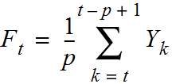
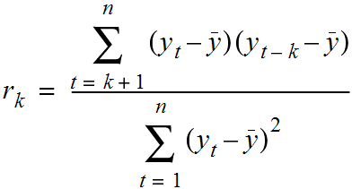

#  Working with Timeseries Data
DS | Lesson 15

### LEARNING OBJECTIVES
**After this lesson, you will be able to:**
- Understand what timeseries data is and what is unique about it
- Perform time series analysis in Pandas including rolling_mean/median and autocorrelation

### STUDENT PRE-WORK
**Before this lesson, you should already be able to:**
- Load data with Pandas, plotting data with Seaborn
- Define and explain the concept of correlation

### LESSON GUIDE
| TIMING | TYPE | TOPIC |
|:-:|---|---|
| 5 min | [Opening](#opening) | Lesson Objectives |
| 30 min | [Introduction](#introduction-timeseries) | Introduction to Timeseries |
| 25 min | [Introduction](#introduction-timeanalytics) | Introduction to Timeseries Analysis |
| 60 min | [Demonstration/Codealong](#code1) | Demonstration/Codealong: Exploring Rossmann Drug Store Sales Data |
| 35 min | [Independent Practice](#ind-practice) | Timeseries Exercises |
| 20 min | [Independent Practice/Review](#ind-practice-review) | Review: Timeseries Exercises|
| 5 min | [Conclusion](#conclusion) | Review Lesson |

---
<a name="opening"></a>
## Opening (5 min)
In this class, we will discuss analyzing data that is changing over time. While most of our previous examples have assumed that our data was collected over time, we did not care which data points were collected earlier or later. We assumed that the data was **not** changing over time.

In this class, we will discuss statistics associated with data with that **is** changing over time and look at how to measure that change.

Specifically, we will focus on **Identifying** problems that are related to time series data and then understanding the types of questions we are interested in. Additionally, we will discuss the unique aspects of **Mining** and **Refining** time series data.

<a name="introduction-timeseries"></a>
## Introduction: What are (is) time series data? (20 mins)

Time series data is any data set where the individual data points change over time.

This would be fairly common in most business data, since we expect sales to change according to the seasons and trends. You will find this property in many social phenomena as well; for example, it has been well documented that traditionally there are higher crime rates in the summer.

To be honest, **most** data sets have an important time component, but we typically assume it is fairly minimal.

If we are attempting to analyze salaries in an industry, it is clear that salaries shift over time, depending on economic factors. But, if we are examining the problem on a smaller scale (say 3-5 years) the effect of time on salaries is much smaller than other variables, like industry or position.

Therefore, we often need to focus on identifying the specific aspects of our data that are influenced by time and those that are not.

Typically, our time series data will be a sequence of values. We will be interested in studying the changes in this series in order to see how related the individual values are. How much does this week's sales affect next week's? How much does today's stock price affect tomorrow's?

**Check** Identify any time components of previous data sets used in class, like the `stumbleupon` data set, for example. This data set collects news stories to see which are more long-lasting. In order to do this, we need to identify current event stories and it is likely we will have to retrain our model over time.

Time series analysis is useful for sales analysis, stock market trends, economic phenomena, social science problems and more.

Typically we are interested in separating the effects of time into two components:
- **Trends**: significant increases or decreases over time
- **Seasonality**: regularly repeating increases or decreases

In the following plot of fireworks injury rates from FiveThirtyEight, we can see there is an overall **trend** of fewer injuries with no **seasonal** pattern.


However, many other phenomena may be entirely seasonal. If we look at the number of searches for the New Hampshire Primary, we can see that there are clear spikes every four years and on election years.


Similarly, searches for "Gingerbread Houses" spike every year around the holiday season.


Both of these spikes re-occur on a fixed time-scale, making them seasonal patterns. While we may see other types of regularly occurring swings (for example, growth vs recession year economic trends), seasonal patterns should repeat on a fixed timescale or **period**.

Repeated patterns that are **aperiodic** are known as **cycles**. While identifying aperiodic cycles are important, they are often treated differently that seasonal effects. Seasonal effects are useful for their consistency, because prior data from previous years/terms/etc is useful as a predictor.

Lastly, "iphone" searches have both a general trend upwards (indicating more popularity for the phone) as well as a spike in September, which is typically when Apple announces new versions.


Most often, we are interested in studying the **trend** and not the seasonal fluctuation. Therefore, it is important to identify whether we think a change in our time series is due to an ongoing trend or a seasonal change.

**Check:** Discuss one or two more time-series examples and identify trends and seasonal patterns. [Google trends](https://www.google.com/trends/) is a nice way to generate examples.

- [Seasonal pattern, with no real growth upward](https://www.google.com/trends/explore#q=superbowl)

- [Strong trend upward over time](https://www.google.com/trends/explore#q=machine%20learning)

- [Trend downward in the use of neural networks, but upward in the use of deep learning](https://www.google.com/trends/explore#q=neural%20networks%2C%20deep%20learning&cmpt=q&tz=Etc%2FGMT%2B5)

<a name="introduction-timeseries-analysis"></a>
## Introduction: Common analysis for time series data (20 mins)

#### Moving Averages
 A **moving average** replaces each data point with an average of **k** consecutive data points in time. Typically this is k/2 data points prior to and following a given time point, but could also be the **k** preceding time points. This is also referred to as the "rolling" average. Our measure of average could be a median or a mean.

 The formula for a rolling **mean** is below:

 

A rolling mean would average all values in the window, but can be skewed by outliers (extremely small or large values). This may be useful if we are looking to identify or evaluate atypical periods. For example, we may want to reward holiday periods or more negatively weight slumps or closures. The rolling median would provide a 50% percentile value for the period, which is perhaps more representative of a "typical" day.

In the following plot from FiveThirtyEight, they have plotted the 30-day moving average of the Economic Uncertainty Index.


Plotting the moving average allows us to more easily visualise trends, by smoothing out random fluctuations and removing outliers.

While this statistic weights all data evenly, it may make more sense to weight data higher the closer it is to our date of interest. This is called taking a **weighted moving average**.

A common weighting scheme is an **exponential weighted moving average**, where we add in a **decay** term and give less and less weight to further data points.

To compute this value, suppose, we have value $v_1, ..., v_N$ and we want to compute a lag $k$ average at time $T$. To start, we fix a decay value $\alpha$. Then, we recursively compute the exponential weighted moving average.

Start with: $M_0 = v_{T-k}$
Then: $M_i = (1-\alpha) * M_{i-1} + v_{T - k + 1}$
Finishing with: $M = M_T = (1-\alpha) * M_{T-1} + v_T$

#### Autocorrelation

While in previous classes, we have been concerned with the correlation between two variables: height and weight, education and salary, etc. In time series data, autocorrelation is a measure of **how correlated a variable is with itself**. Specifically, autocorrelation measures how closely related earlier variables are with variables occurring later in time.



To compute autocorrelation, we fix a "lag", k, which is how many time points earlier we should use to compute the correlation.

With a lag of 1, we would compute how correlated a value is with the prior one. With a lag of 10, we would compute how correlated a variable is with one 10 time points earlier.

<a name="code1"></a>
## Demonstration/Codealong: Exploring Rossmann Drug Store Sales Data (10 mins)

We will be using data made available by a German drugstore, Rossmann. This data contains the daily sales made at the drugstore as well as whether a sale or holiday affected the sales data.

#### Loading the data

As with previous data sets, we can use Pandas to load our data:

```python
import pandas as pd
data = pd.read_csv("../assets/data/rossmann.csv", skipinitialspace = True)
```

Because we are most interested in the `Date` column (which contains the date of sales for each store), we will make sure to process that as a `DateTime` type and make it the index of our dataframe.

```python
data["Date"] = pd.to_datetime(data["Date"])
data.set_index("Date", inplace = True)
data["Year"] = data.index.year
data["Month"] = data.index.month
```

This allows us to easily filter by date as well. For example, we can filter to a particular year:

```python
data["2014"]
```

Or to a particular month:

```python
data["2015-05"]
```

There are over a million sales data point in this data set, so for some analysis we will focus on just one store.

```python
store1_data = data[data.Store == 1]
```

#### Plotting the sales data

As we begin to study the sales from this drugstore, we also want to know both the time dependent elements of sales as well as whether promotions or holidays effected these sales. To start, we can compare the average sales on those events.

To compare sales on holidays, we can compare the sales using box-plots, which allows us to compare the distribution of sales on holidays against all other days. On state holidays the store is closed (which means there are 0 sales) and on school holidays the sales are relatively similar.

```python
sb.factorplot(
    x = "SchoolHoliday",
    y = "Sales",
    data = store1_data,
    kind = "box")
```

**Check:** Now check to see if there is a difference affecting sales on promotion days.

We can see that there **is** a difference in sales on promotion days.

```python
sb.factorplot(
    col = "Open",
    x = "Promo",
    y = "Sales",
    data = store1_data,
    kind = "box")
```

Why is it important to separate out days where the store is closed? Because there are not any promotions on those days either, so including them will bias your sales data on days without promotions!

We may also want to compare sales across days of the week:

```python
sb.factorplot(
    col = "Open",
    x = "DayOfWeek",
    y = "Sales",
    data = store1_data,
    kind = "box")
```

Lastly, we want to identify larger-scale trends in our data. How did sales change from 2014 to 2015? Were any particularly interesting outliers in terms of sales or customer visits?

To plot the sales over time:

```python
# Filter to days store 1 was open
store1_open_data = store1_data[store1_data.Open == 1]
store1_open_data[["Sales"]].plot()
```

To plot the customer visits over time:

```python
store1_open_data[["Customers"]].plot()
```

We can see that there are large spikes of sales and customers towards the end of 2013 and 2014, leading into the first quarter of 2014 and 2015.

**Check:** Use the index filtering to filter just 2015 and zoom in on changes over time. This should make it easier to identify the holiday sales bump.

```python
store1_data_2015 = store1_data["2015"]
store1_data_2015[store1_data_2015.Open == 1][["Sales"]].plot()
```

#### Computing Autocorrelation

To measure how much the sales are correlated with each other, we want to compute the **autocorrelation** of the "Sales" column. In pandas, we will do this with the `autocorr` function.

`autocorr` takes one argument, the `lag` - which is how many prior data points should be used to compute the correlation. If we set the `lag` to 1, we compute the correlation between every point and the point directly preceding it, while setting `lag` to 10. This computes the correlation between every point and the point 10 days earlier:

```python
data["Sales"].resample("D").mean().autocorr(lag = 1)
```

Just like with correlation between different variables, the data becomes more correlated as this number moves closer to 1.

**Check:** What does the autocorrelation values of Sales and Customers imply about our data?

#### Aggregates of sales over time

If we want to investigate trends over time in sales, as always, we will start by computing simple aggregates. We want to know: what were the mean and median sales in each month and year?

In Pandas, this is performed using the `resample` command, which is very similar to the `groupby` command. It allows us to group over different time intervals.

We can use `data.resample` and provide as arguments:
- The level on which to roll-up to, "D" for day, "W" for week, "M" for month, "A" for year
- The aggregation to perform: "mean", "median", "sum", etc.

```python
data[["Sales"]].resample("A").apply(["median", "mean"]).head()
data[["Sales"]].resample("M").apply(["median", "mean"]).head()
```

Here we can see again that December 2013 and 2014 were the highest average sale months.

While identifying monthly averages is useful, we often want to compare the sales data of a date to a smaller window. To understand holidays sales, we do not want to compare sales data in late December with the entire month, but instead to a few days immediately surrounding it. We can do this using rolling averages.

In pandas, we can compute rolling average using the `pd.rolling_mean` or `pd.rolling_median` functions.

```python
data[["Sales"]].resample("D").mean().rolling(window = 3, center = True).mean().head()
```

This computes a rolling mean of sales using the sales on each day, the day preceding and the day following (window = 3, center = True).

`rolling` takes three important parameters:
- `window` is the number of days to include in the average
- `center` is whether the window should be centered on the date or use data prior to that date
- `freq` is on what level to roll-up the averages to (as used in `resample`). Either `D` for day, `M` for month or `A` for year, etc.

We can use our index filtering to just look at 2015.

```python
data[["Sales"]].resample("D").mean().rolling(window = 3, center = True).mean()["2015"]
```

Instead of plotting the full time series, we can plot the rolling mean instead, which smooths random changes in sales as well as removing outliers, helping us identify larger trends.

```python
data[["Sales"]].resample("D").mean().rolling(window = 10, center = True).mean().plot()
```

As we discussed earlier, this averages all values in the window evenly, but we might want to weight closer values more. For example, with a centered weighted average of 10 days, we want to put additional emphasis on +/- 1 day versus +/- days. One option to do that is the `ewma` function or `exponential weighted moving average` function.

```python
pd.ewma(data["Sales"], span = 10)
```

**Check:** Discuss the differences in the plot between the 10-day moving average and the 10 day exponentially weighted moving average.

#### Pandas Window functions

Pandas `rolling().mean` and `rolling().median` are only two examples of Pandas window function capabilities. Window functions operate on a set of N consecutive rows (i.e.: a window) and produce an output.

In addition to `rolling().mean` and `rolling().median`, there are `rolling().sum`, `rolling().min`, `rolling().max`... and many more.

Another common one is `diff`, which takes the difference over time. `df.diff` takes one argument: `periods`, which measures how many rows prior to use for the difference.

For example, if we want to compute the difference in sales, day by day, we could compute:

```python
data["Sales"].diff(periods = 1)
```

However, if wanted to compare the same day the prior week, we could set `periods = 7`

```python
data["Sales"].diff(periods = 7)
```

This would compute the difference in sales from every day to the same day in a previous week. **Difference functions** allow us to identify seasonal changes when we see repeated up or downswings.

The following plot of the month to month change (`diff`) in jobs from FiveThirtyEight helps identify the seasonal component to a number of retail jobs:


#### Pandas Expanding Functions

In addition to the set of `rolling` functions, Pandas also provides a similar collection of `expanding` functions, which, instead of using a window of N values, uses all values up until that time.

For example,

```python
data[["Sales"]].resample("D").mean().expanding().mean().head()
```

computes the average sales, from the first date **until** the date specified. Meanwhile:

```python
data[["Sales"]].resample("D").mean().expanding().sum().head()
```

computes the sum of average sales per store up until that date.

<a name="ind-practice"></a>

1. Plot the distribution of sales by month and compare the effect of promotions.
2. Are sales more correlated with the prior date, a similar date last year or a similar date last month?
3. Plot the 15 day rolling mean of customers in the stores.
4. Identify the date with largest drop in sales from the same date in the previous month.
5. Compute the total sales up until Dec. 2014.
6. When were the largest differences between 15-day moving/rolling averages? HINT: Using `rolling_mean` and `diff`

<a name="ind-practice-review"></a>

1. Plot the distribution of sales by month and compare the effect of promotions

```python
sb.factorplot(
    col = "Open",
    hue = "Promo",
    x = "Month",
    y = "Sales",
    data = store1_data,
    kind = "box")
```

2. Are sales more correlated with the prior date, a similar date last year or a similar date last month?

```python
# Compare the following:
average_daily_sales = data[["Sales", "Open"]].resample("D").mean()
average_daily_sales["Sales"].autocorr(lag = 1)
average_daily_sales["Sales"].autocorr(lag = 30)
average_daily_sales["Sales"].autocorr(lag = 365)
```

3. Plot the 15 day rolling mean of customers in the stores:

```python
data[["Sales"]].resample("D").mean().rolling(window = 15).mean().plot()
```

4. Identify the date with largest drop in sales from the same date in the previous month:

```python
average_daily_sales = data[["Sales", "Open"]].resample("D").mean()
average_daily_sales["DiffVsLastWeek"] = average_daily_sales[["Sales"]].diff(periods = 7)
average_daily_sales.sort_values(by = "DiffVsLastWeek").head()
```

Unsurprisingly, this day is Dec. 25 and Dec. 26 in 2014 and 2015, when the store is closed and there are many sales in the preceding week. How about when the store is open?

```python
average_daily_sales[average_daily_sales.Open == 1].sort_values(by = "DiffVsLastWeek").head()
```

The top values are Dec. 24th, but sales on 2013-12-09 and 2013-10-14 were on average 4k lower than the same day in the previous week.

5. Compute the total sales up until Dec. 2014:

```python
total_daily_sales = data[["Sales"]].resample("D").sum()
total_daily_sales.expanding().sum()["2014-12"].head()
```

6. When were the largest differences between 15-day moving/rolling averages?
HINT: Using `rolling_mean` and `diff`

```python
data[["Sales"]].resample("d").mean().rolling(window = 15).mean().diff(1).sort_values(by = "Sales").head()
```

Unsurprisingly, they occur at the beginning of every year after the holiday season.

<a name="conclusion"></a>
## Conclusion (5 mins)
- We use time series analysis to identify changes in values over time
- We want to identify whether changes are true trends or seasonal changes
- Rolling means give us a local statistic of an average in time, smoothing out random fluctuations and removing outliers
- Autocorrelations are a measure of how much a data point is dependent on previous data points

***

### BEFORE NEXT CLASS
|   |   |
|---|---|
| Upcoming Projects | [Final Project, part 3](../../projects/final-projects/part-03/README.md)
